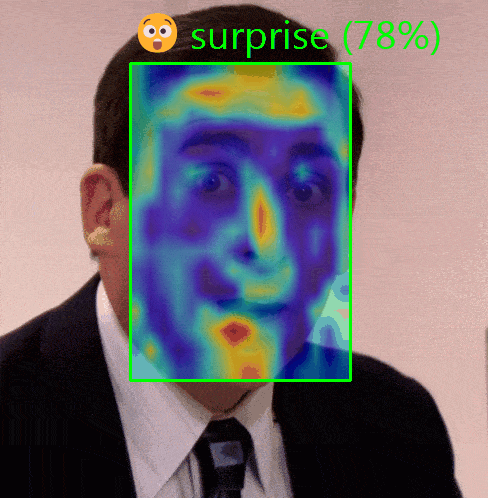
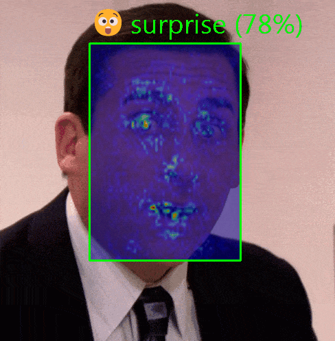
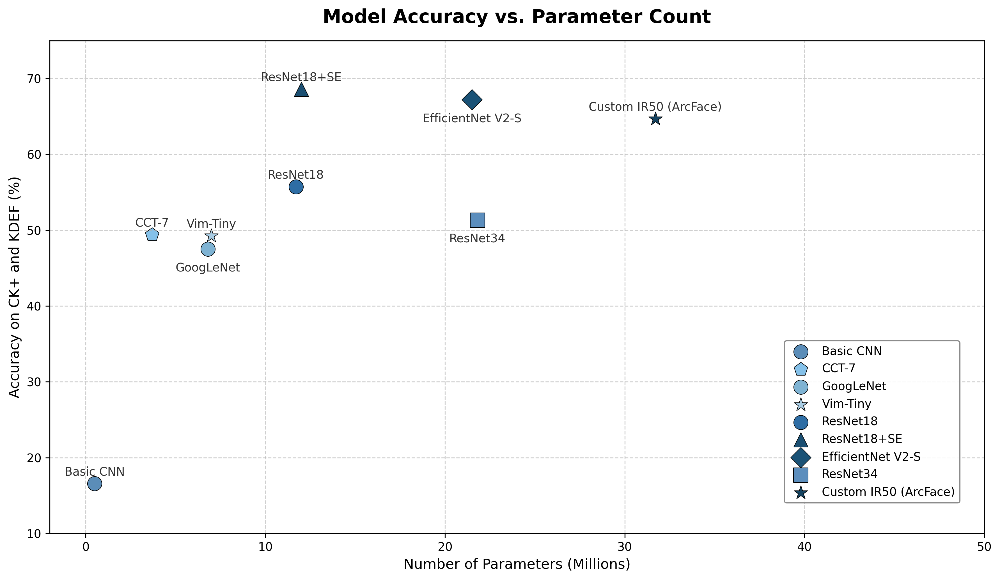
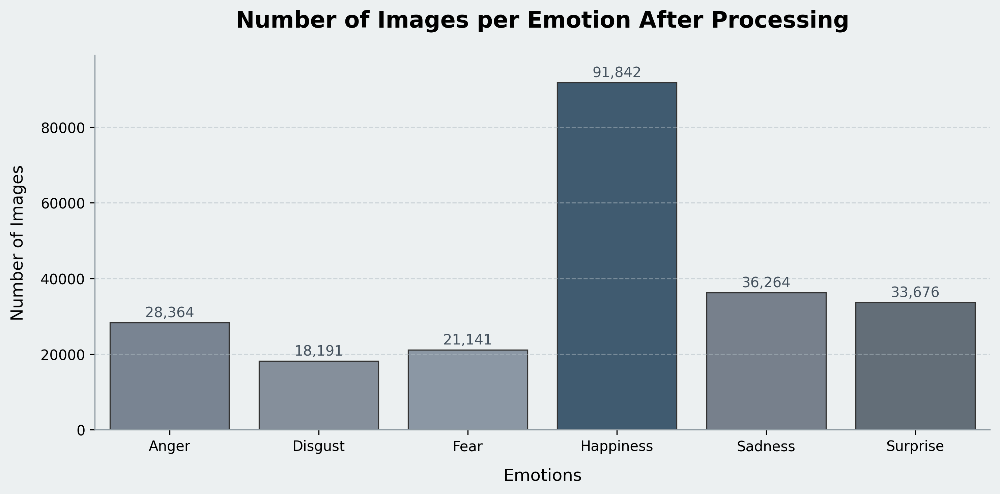

# EmotionClassifier

A comprehensive repository for emotion classification using various deep learning architectures, including EfficientNetV2, Vision Mamba (Vim), ResNet18-SE, and IR50. This project includes a complete pipeline from preprocessing and training to a functional video processing demo with Explainable AI (XAI) capabilities.
*Note: The demo outputs below were generated using the **ResNet18-SE** architecture.*

| GradCAM | Integrated Gradients |
|---------|---------------------|
|  |  |

## Project Goal

The primary goal of this project was to research and evaluate various methodologies, research papers, and deep learning models to improve the accuracy of emotion prediction. Starting from scratch with almost no prior knowledge of Python and no knowledge of PyTorch, our group of four built this project from the ground up. Key objectives included:
- Training at least one model entirely from scratch.
- Experimenting with a wide range of different architectures and approaches.
- Empirically validating the effectiveness of these methods based on initial motivations and hypotheses.

**Project Duration:** December 18, 2025 – February 22, 2026 (Exluding Prior Research Described in Perliminary Report)

## Project Structure

Here is an overview of the main directories in this repository:

*   **`demo`**: Contains scripts to demonstrate the emotion classifier in different contexts:
    *   **`Images`**: Processes a folder of images and outputs a CSV of predicted emotion probabilities.
    *   **`Video`**: Processes a video or GIF, outputting a new file overlaid with bounding boxes, predictions, and Exaplainable AI (XAI) heatmaps (GradCAM or Integrated Gradients).
    *   **`WebcamDemo`**: Real-time emotion classification on a live webcam feed, with optional live XAI headmaps.
*   **`models`**: Contains contributor-specific experiments and distinct architectures (Aleks, Dmytro, Daniel, Tiago). The specific architectures tested include:
    *   **ResNet18** (Including SE, CBAM, and LReLU variants)
    *   **EfficientNetV2-S** 
    *   **Vision Mamba (Vim)**
    *   **Compact Convolutional Transformer (CCT)**
    *   **ConvNeXt** (V2 Atto, Custom EmoNeXt)
    *   **VGGNet & GoogLeNet**
    *   **Custom CNNs** (CNN5, CERNbased)
*   **`preprocessing`**: Pipeline scripts (filters, deduplication, resizing) used to clean and normalize the datasets before training.
*   **`reports`**: Project documentation, analysis figures, and the preliminary/final reports.
*   **`resources`**: Static assets, including test videos, sample GIFs, and outputs.
*   **`transfer_learning`**: Scripts focused on fine-tuning pre-trained models (specifically IR50).
*   **`XAI_testing`**: Experimental code evaluating various Explainable AI methods (some approaches here were exploratory and did not end up in the final pipeline).

## Model Performance and Efficiency

- **EfficientNetV2-S**: 88.1% accuracy on CK+



**Pre-Trained Weights:** You can find and download the pre-trained weights for the models and their variations here:
**[Google Drive Link](https://drive.google.com/drive/folders/1mWiACcKtItb3BU19DYtzwgzEocINLkJZ?usp=sharing)**

## Demo

The demo demonstrates real-time emotion classification on video files or GIFs. It detects faces, classifies their prevailing emotion, and optionally overlays visual explanations (heatmaps) to show which parts of the face contributed most to the decision.


### How to Run

To run the demo, use the `process_video.py` script located in the `demo` directory.

```bash
python demo/process_video.py <input_video_path> [options]
```

**Examples:**

```bash
# Basic usage
python demo/process_video.py inputs/my_video.mp4

# Initial run with GradCAM XAI (default)
python demo/process_video.py inputs/my_video.mp4 --xai gradcam

# Use Integrated Gradients for XAI
python demo/process_video.py inputs/my_video.mp4 --xai ig

# Use Haar Cascade/RetinaFace detector
python demo/process_video.py inputs/my_video.mp4 --face-detector haarcascade

# Save to specific output
python demo/process_video.py inputs/my_video.mp4 --output results/output.mp4
```

### Process Video Script (`demo/process_video.py`)

The `process_video.py` script handles the entire inference pipeline:
1.  **Input Reading**: Supports both standard video formats (`.mp4`, `.avi`, etc.) and `.gif` files via a custom `GifReader`.
2.  **Face Detection**: capable of using either **RetinaFace** (default, higher accuracy) or **Haar Cascades** (faster, lower accuracy).
3.  **Preprocessing**: Crops faces, resizes them to 64x64, and normalizes them to match training conditions.
4.  **Inference**: Runs the loaded model (e.g., ResNet18SE) to predict one of 6 emotions: anger, disgust, fear, happiness, sadness, surprise.
5.  **XAI Overlay**: Generates heatmaps using **GradCAM** or **Integrated Gradients** to visualize model focus.
6.  **Output**: Annotates the video with bounding boxes, emotion labels, confidence scores, and emojis. Saves as video or GIF depending on the output extension.


## Preprocessing

The preprocessing pipeline ensures high-quality input data by filtering and normalizing raw images before training.

### Pipeline Structure
The preprocessing is managed by a pipeline system (see `preprocessing/pipeline.py` and `preprocessing/dataset_runner.py`) that applies a sequence of steps to every image in a dataset folder.

### Filters and Steps
The standard preprocessing pipeline includes the following steps:

1.  **`FaceExistenceFilter`**: Ensures a face is actually present in the image with high confidence.
2.  **`FaceRotationFilter`**: Corrects or filters images based on yaw rotation (looking left/right).
3.  **`FaceOrientationFilter`**: Corrects in-plane rotation (roll correction).
4.  **`LightingFilter`**: Filters out images with poor lighting conditions (too dark/bright).
5.  **`RemoveBlurredFaces`**: Detects and removes blurry images.
6.  **`CroppingFace`**: Tight crops around the detected face.
7.  **`ResizingTo64`**: Resizes the cropped face to a standard 64x64 resolution.
8.  **`ToRGB`**: Converts images to 3-channel RGB.

### Example Pipeline Configuration
To run the preprocessing, you configure the `steps` array in `preprocessing/pipeline/run_preprocessing.py`. For example, for **EmoSet**:

```python
# In run_preprocessing.py
steps = [
    # ... your filter and step instances here ...
    FaceExistenceFilter(),
    CroppingFace(),
    ResizingTo64(),
    ToRGB()
]
```

### Dataset Preprocessing Summary

The following table details the specific preprocessing steps applied to each dataset used in this project:

| Dataset | Preprocessing Steps | Classes Removed | Classes Kept |
| :--- | :--- | :--- | :--- |
| **EmoSet** (118k labeled) | FaceExistenceFilter, CroppingFace, ResizingTo64, ToRGB | - | - |
| **ExpW** (normal, not cleaned) | CroppingFace, FaceExistenceFilter (with high accuracy), ResizingTo64, ToRGB | disgust, sadness | anger, happiness (among others) |
| **jaffe** | ResizingTo64, ToRGB | - | - |
| **KDEF** | CroppingFace, ResizingTo64, ToRGB (whole dataset used for Test only) | - | - |
| **NHFI** | ResizingTo64, ToRGB | - | - |
| **NONAME** | CroppingFace, ResizingTo64, ToRGB | - | - |
| **WSEFEP** | ResizingTo64, ToRGB | - | - |
| **AffectNet** | ResizingTo64, ToRGB | - | - |
| **CKplus** | ResizingTo64, ToRGB (whole dataset used for Test only) | - | - |
| **FERPlus** | ResizingTo64, ToRGB | - | - |
| **RAF-DB** | ResizingTo64, ToRGB | - | - |
| **MMAFEDB** | ResizingTo64, ToRGB | - | - |

### Dataset Distribution After Preprocessing

Number of images per emotion after the second stage of preprocessing:



### Deduplication
A **Duplication Pre-processing** step (refer to `preprocessing/image_duplicates.py`) is used to clean datasets. It employs **Difference Hashing (dHash)** to identify and remove near-duplicate images, ensuring that the model doesn't overfit to repeated data.

## Transfer Learning

The `transfer_learning` directory contains scripts for fine-tuning pre-trained models, specifically focusing on **IR50** (ResNet50-IR).

*   **Objective**: To leverage powerful pre-trained face recognition features (originally trained on CelebA) for emotion classification. The pre-trained weights were sourced from [Qualitative Content Selection (QCS)](https://github.com/birdwcp/QCS/tree/main).
*   **Evolution**:
    1.  **Original**: Fine-tuning the standard IR50 backbone.
    2.  **Layer Freezing**: Experimenting with freezing different blocks of the backbone (`train_ir50_layer_freezing.py`) to prevent overfitting and preserve low-level features.
    3.  **Light Head (Final Version)**: The final iteration (`train_ir50_light_head.py`) replaces the massive 12.8M parameter fully-connected head with a lightweight, attention-based head (~795K params).
*   **Key Script**: `transfer_learning/train_ir50_light_head.py`
*   **Techniques**:
    *   **Light Head Architecture**: Uses **Spatial Attention** (to focus on key facial regions like eyes/mouth) followed by Global Average Pooling, significantly reducing parameters while maintaining spatial awareness.
    *   **Class Balanced Focal Loss (CBFL)**: Handles class imbalance in emotion datasets.
    *   **Differential Learning Rates**: Fine-tunes the backbone gently (low LR) while training the new head aggressively (high LR).
    *   **Mixup**: Data augmentation technique aimed at improving generalization.
